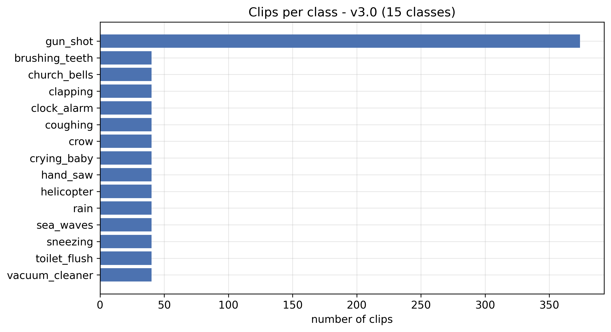

# 3. MATERYAL VE YÖNTEM

Bu bölümde, önerilen seçici gürültü engelleme sisteminin tüm bileşenleri ayrıntılı biçimde açıklanmıştır. Önce genel sistem mimarisi ve veri akışı tanıtılmış; ardından ses ön işleme ve spektrogram temsili, kullanılan veri kümeleri, anlık karışım üreteci, FiLM-koşullu U-Net mimarisi, kayıp fonksiyonları, optimizasyon süreci ve çıkarım hattı sırasıyla ele alınmıştır. Açıklamalar, modelin v3.0 sürümünde kullanılan yapılandırma temel alınarak verilmiştir.

## 3.1 Genel Sistem Mimarisi ve Veri Akışı

Sistem, eğitim ve çıkarım olmak üzere iki ayrı veri akışından oluşmaktadır. Eğitim akışında, ham ses kümeleri bellek içi bir klip önbelleğine çözülmekte, bu önbellekten anlık olarak karışımlar sentezlenmekte ve FiLM-koşullu U-Net bu karışımlar üzerinde eğitilmektedir. Çıkarım akışında ise eğitilmiş model, kullanıcının yüklediği dosyada bulunan sınıfları tespit etmekte ve seçilen sınıfları örtüşmeli toplama yöntemiyle dosyadan çıkarmaktadır. Sistemin uçtan uca veri akışı Şekil 3.1'de şematik olarak gösterilmiştir.

```
ESC-50 + UrbanSound8K (ham WAV kayıtları)
    → load_all_datasets        : {sınıf: [dalga biçimi]} bellek içi önbellek
    → SeparationMixer          : anlık karışım, sorgu ve hedef stem üretimi
    → ConditionedSeparatorTrainer : FiLM U-Net, çok çözünürlüklü L1 + BCE
    → separator_unet_film_multi_v3.0.h5
    → webapp                   : tespit → maske → ISTFT → yeniden sentez
```
**Şekil 3.1:** Önerilen sistemin uçtan uca veri akışı şeması.

Yazılım mimarisi, sorumlulukların ayrıştırıldığı modüler bir yapıda tasarlanmıştır. Veri hazırlama katmanı (`dataset_sources.py` ve `separation_mixer.py`), veri kümelerinin yüklenmesinden ve karışımların üretilmesinden; model eğitimi katmanı (`conditioned_separator.py` ve `train_conditioned_separator.py`), ağ mimarisinin tanımlanmasından ve eğitilmesinden; uygulama katmanı (`webapp.py`) ise çıkarımın kullanıcı arayüzüyle bütünleştirilmesinden sorumludur. Model sürümü ve dosya yolları, ortam değişkeniyle denetlenebilen merkezi bir yapılandırma modülünde (`model_config.py`) tutulmakta; böylece farklı sürümler arasında geçiş, kaynak kodu değiştirmeden yapılabilmektedir. Bu modüler kurgu, sürüm tabanlı deneysel metodolojinin (Bölüm 4) izlenebilirliğini de sağlamaktadır.

## 3.2 Ses Ön İşleme ve Spektrogram Temsili

Modelin tüm girişleri, ortak bir spektrogram sözleşmesine indirgenmiştir. Bu sözleşme, hem eğitim hem de çıkarım hatlarında birebir aynı parametrelerle uygulanarak eğitim ve çıkarım dağılımlarının tutarlılığı güvence altına alınmıştır.

### 3.2.1 Örnekleme ve Tek Kanala İndirgeme

Tüm ses verileri $16$ kHz örnekleme hızında yeniden örneklenmiş ve tek kanala (mono) indirgenmiştir. $16$ kHz örnekleme hızı, Nyquist–Shannon örnekleme kuramı gereği $8$ kHz'e kadar olan frekans bileşenlerinin temsil edilmesine olanak tanımaktadır; bu bant, çevresel seslerin algısal olarak baskın enerjisini içermektedir. Daha yüksek örnekleme hızları ($44{,}1$ kHz gibi) ek bir üst-bant ayrıntısı sağlasa da, spektrogram boyutunu ve dolayısıyla hesaplama ile bellek yükünü orantısız biçimde artırmaktadır. Bu nedenle $16$ kHz, temsil yeterliliği ile hesaplama maliyeti arasında bir uzlaşı noktası olarak belirlenmiştir. Çok kanallı kayıtlar, kanal ortalaması alınarak tek kanala indirgenmiş; böylece modelin girişi, kanal sayısından bağımsız hâle getirilmiştir.

### 3.2.2 Kısa Zamanlı Fourier Dönüşümü Sözleşmesi

Zaman düzlemindeki dalga biçimi, Kısa Zamanlı Fourier Dönüşümü (STFT) ile zaman-frekans düzlemine taşınmıştır. STFT, bir analiz penceresi $w[n]$ kaydırılarak hesaplanan ardışık Fourier dönüşümleri olarak tanımlanmaktadır:

$$X[k, m] = \sum_{n=0}^{L-1} w[n]\, x[n + mH]\, e^{-j 2\pi k n / L},$$

burada $L$ pencere uzunluğu (FFT boyutu), $H$ sıçrama uzunluğu (hop length), $k$ frekans bini ve $m$ zaman çerçevesi indisidir. Bu çalışmada $L = n_{\text{fft}} = 512$ ve $H = hop = 128$ değerleri seçilmiştir. $16$ kHz örnekleme hızında bu değerler, $32$ ms'lik bir analiz penceresine ve $8$ ms'lik bir çerçeve adımına karşılık gelmekte; ardışık pencereler arasında $\%75$ örtüşme sağlamaktadır. Pencereleme işlevi olarak Hann penceresi kullanılmıştır; bu pencere, spektral sızıntıyı sınırlandırması ve örtüşmeli toplama altında birim-zarf koşulunu yaklaşık olarak sağlaması bakımından tercih edilmiştir.

$512$ noktalı FFT, $257$ adet tek-yanlı frekans bini üretmektedir. Nyquist bini ($k = 256$) düşürülerek model girişi $256$ frekans binine indirgenmiş; böylece frekans ekseni, evrişimsel alt örnekleme için elverişli olan $2$'nin kuvveti bir boyuta ($256$) sabitlenmiştir. Bir saniyelik bir pencere ($16\,000$ örnek), merkez hizalı STFT altında yaklaşık $126$ zaman çerçevesi üretmekte; bu eksen, sabit girdi boyutu için $128$ çerçeveye sıfır-doldurma ile tamamlanmaktadır. Sonuç olarak modelin girişi, $(256, 128, 1)$ boyutlu bir genlik spektrogramı tensörüdür ve her tensör yaklaşık bir saniyelik akustik bağlamı temsil etmektedir.

### 3.2.3 Logaritmik Genlik Sıkıştırması

Ses sinyallerinin genlik spektrumu, birkaç on yıllık (decade) bir dinamik aralığa yayılmaktadır. Bu geniş aralığın doğrudan ağa verilmesi, yüksek enerjili bileşenlerin gradyanları baskılamasına ve düşük enerjili ancak algısal olarak önemli bileşenlerin göz ardı edilmesine yol açmaktadır. Bu nedenle model girişinde, genlik spektrogramına logaritmik sıkıştırma uygulanmıştır:

$$X_{\log}[k, m] = \log\!\big(1 + |X[k, m]|\big).$$

$\log(1 + \cdot)$ biçimindeki sıkıştırma, sıfır genlikte tanımlı kalması (logaritmanın tekilliğinden kaçınması) ve küçük genlikler için yaklaşık doğrusal davranması bakımından tercih edilmiştir. Bu dönüşüm, dinamik aralığı sıkıştırarak eğitim kararlılığını artırmakta ve insan işitmesinin logaritmik yükseklik algısıyla örtüşmektedir. Modelin yalnızca logaritmik genlik girişiyle koşullandırıldığı; maskenin uygulanacağı doğrusal genliğin ise ayrı bir giriş olarak ağ grafiğine taşındığı vurgulanmalıdır. Bu ayrım sayesinde maske, doğrusal genlik üzerinde uygulanmakta ve kestirilen stem, ölçek bilgisini koruyarak yeniden sentezlenebilmektedir (Alt Başlık 3.5.5).

## 3.3 Veri Kümeleri

Modelin sözcük dağarcığı, halka açık çevresel ses veri kümelerinin birleştirilmesiyle oluşturulmuştur. Birleştirme işlemi, her veri kümesini ortak bir $\{$sınıf$:$ dalga biçimi listesi$\}$ sözlüğüne çözen ve bu sözlükleri tek bir önbellekte toplayan veri yükleme katmanı tarafından yürütülmektedir.

### 3.3.1 ESC-50

ESC-50, elli çevresel ses sınıfından oluşan ve sınıf başına kırk klip içeren, toplam iki bin kayıtlık bir veri kümesidir [31]. Her klip beş saniye uzunluğundadır ve hayvan sesleri, doğal ses olayları, insan kaynaklı sesler, iç mekân sesleri ve kentsel gürültü gibi geniş bir akustik yelpazeyi kapsamaktadır. Sınıf başına klip sayısının sınırlı olması, bu çalışmadaki minimum klip tabanı eşiğinin (Alt Başlık 3.3.4) belirlenmesinde de belirleyici olmuştur.

### 3.3.2 UrbanSound8K ve Sınıf Birleştirme

UrbanSound8K, on kentsel ses sınıfından oluşan ve sekiz binin üzerinde klip içeren bir veri kümesidir [32]. Bu kümenin bazı sınıfları, ESC-50 ile anlamsal olarak örtüşmektedir. Örtüşen sınıfların ayrı etiketler hâline gelmesini önlemek için bir takma ad eşlemesi (`CLASS_ALIASES`) tanımlanmış; örneğin UrbanSound8K'deki köpek havlaması sınıfı (`dog_bark`), ESC-50'deki köpek sınıfına (`dog`), motor rölantisi sınıfı (`engine_idling`) ise motor sınıfına (`engine`) eşlenmiştir. Bu eşleme sayesinde örtüşen sınıfların klipleri tek bir kanonik etiket altında havuzlanmakta; UrbanSound8K'nin on sınıfından dördü ESC-50 ile birleşmekte, altısı ise yeni sınıf olarak eklenmektedir. İki veri kümesinin birlikte yüklenmesiyle modelin sözcük dağarcığı yaklaşık elli altı sınıfa ulaşmaktadır.

### 3.3.3 FSD50K ve Uzun Kuyruk Problemi

FSD50K, AudioSet ontolojisine göre etiketlenmiş, yaklaşık iki yüz sınıf içeren büyük ölçekli bir ses olayı veri kümesidir [33]. Bu kümede etiketler hiyerarşiktir ve çoğu klip virgülle ayrılmış birden çok etikete sahiptir; bu çalışmada her klibin ilk (en özgül/yaprak) etiketi kanonik sınıf olarak alınmıştır. FSD50K'nin sözcük dağarcığını genişletme potansiyeli bulunmakla birlikte, yaprak etiketlerinin önemli bir bölümünün yalnızca birkaç klip tarafından desteklenmesi, bir "uzun kuyruk" problemi doğurmaktadır. Az sayıda ve çok-etiketli örnekten öğrenilen bir sınıf, ayırt edici olmayan ve dağınık bir maske üretmekte; bu maske, ilgili sınıf karışımda bulunmasa dahi yüksek enerji üreterek yanlış pozitiflere yol açmaktadır. Bu olgu, dördüncü bölümde ayrıntılandırılan sürüm evriminde (özellikle v2.3–v2.4) belirleyici bir başarısızlık örüntüsü olarak gözlemlenmiş ve modelin son sürümünde FSD50K bütünüyle dışarıda bırakılmıştır.

### 3.3.4 Minimum Klip Tabanı ve Düzenlenmiş Sözcük Dağarcığı

Az desteklenen sınıfların yarattığı yanlış pozitif eğilimini sınırlandırmak için, birleştirme sonrası uygulanan bir minimum klip tabanı eşiği tanımlanmıştır. Bu eşik, sınıf başına en az kırk klip ($N_{\min} = 40$) koşulunu sağlamayan sınıfları sözcük dağarcığından çıkarmaktadır. Eşik birleştirmeden *sonra* uygulandığından, veri kümeleri arası takma adlar önce havuzlanmakta; yalnızca gerçekten yetersiz desteklenen sınıflar elenmektedir. ESC-50 (sınıf başına kırk klip) ve UrbanSound8K (sınıf başına yüzlerce klip) sınıfları bu eşikten etkilenmemektedir.

Modelin son sürümü (v3.0), ayrıştırma ve tespit başarımının en yüksek olduğu on beş sınıftan oluşan, düzenlenmiş (curated) bir alt küme üzerinde eğitilmiştir. Bu alt küme, `keep_classes` parametresiyle yalnızca döndürülen sözlüğe uygulanmakta; diskteki çözülmüş önbellek tam sözcük dağarcığını koruduğundan, düzenlenmiş alt küme çalışması ile tam sözcük dağarcığı çalışması aynı önbellek dosyasını paylaşabilmektedir. Seçilen on beş sınıfın klip dağılımı Şekil 3.2'de gösterilmiştir; `gun_shot` sınıfı (UrbanSound8K katkısıyla) $374$ klip içerirken, kalan on dört sınıf $N_{\min} = 40$ tabanında dengelenmiştir.



**Şekil 3.2:** v3.0 sürümünün on beş sınıflı düzenlenmiş sözcük dağarcığında sınıf başına klip sayısı.

## 3.4 Anlık Veri Üretimi: SeparationMixer

Eğitim örnekleri, önceden üretilmiş bir veri dosyasından okunmak yerine, bellek içi klip önbelleğinden her eğitim adımında anlık olarak sentezlenmektedir. Bu görev, sonsuz bir örnek akışı üreten `SeparationMixer` sınıfı tarafından yürütülmektedir. Her örnek, bir karışım spektrogramı, bir sınıf sorgusu ve o sınıfın hedef stem genliğinden oluşan bir üçlüdür. Anlık üretim yaklaşımı, hem depolama yükünü ortadan kaldırmakta hem de aynı kliplerin farklı genlik, pencere ve birleşimlerle yeniden kullanılması sayesinde görece sınırsız bir karışım çeşitliliği sağlamaktadır.

### 3.4.1 Karışım Sentezi ve Genlik Örnekleme

Bir karışım örneği oluşturulurken, önce karışıma katılacak kaynak sayısı $k$, $\{1, 2, \dots, K_{\max}\}$ kümesinden düzgün dağılımla çekilmektedir; bu çalışmada $K_{\max} = 4$ alınmıştır. Ardından sözcük dağarcığından $k$ adet sınıf yerine koymadan örneklenmekte ve her sınıf için önbellekten rastgele bir klip seçilmektedir. Seçilen her klipten, bir saniyelik bir pencere rastgele konumdan kırpılmakta (klip bir saniyeden kısaysa sıfır-doldurma uygulanmakta) ve bu pencere, $[0{,}4;\, 1{,}0]$ aralığından düzgün dağılımla çekilen bir genlik katsayısı $a_i$ ile ölçeklenmektedir. Karışım, ölçeklenmiş pencerelerin toplamı olarak elde edilmektedir:

$$x[n] = \sum_{i=1}^{k} a_i\, s_i[n], \qquad a_i \sim \mathcal{U}(0{,}4;\, 1{,}0).$$

Genlik katsayılarının rastgeleleştirilmesi, modelin farklı bağıl ses düzeylerine karşı dayanıklılık kazanmasını sağlamakta; her kaynağın hedef stem'i, ilgili ölçeklenmiş pencere olarak ayrı ayrı saklanmaktadır.

### 3.4.2 Negatif Örnekler ve Sessizlik Hedefi

Modelin, karışımda bulunmayan bir sınıf sorgulandığında yakın-sıfır bir maske üretmeyi öğrenmesi, seçici bastırmanın temel koşuludur. Bu amaçla, $P_{\text{negatif}}$ olasılığıyla bir *negatif örnek* üretilmektedir: sorgu, karışımda bulunmayan bir sınıfı işaret etmekte ve hedef stem sessizlik (tümüyle sıfır) olarak atanmaktadır. Geri kalan örneklerde sorgu, karışımda bulunan bir sınıfı işaret etmekte ve hedef, o sınıfın stem'i olmaktadır.

$P_{\text{negatif}}$ parametresinin seçimi, kritik bir ödünleşim içermektedir. Çok yüksek bir değer, L1 kaybının her şey için yakın-sıfır çıktıyı ödüllendirmesine ve modelin "güvenli sessizlik" dengesine çökmesine yol açmaktadır; bu olgu, dördüncü bölümde ayrıntılandırılan v2.0 sürümünde $P_{\text{negatif}} = 0{,}45$ değerinde gözlemlenmiştir. Çok düşük bir değer ise yetersiz bastırmaya neden olmaktadır. Modelin son sürümünde, tespit başının yeterli negatif maruziyetle eğitilebilmesi için $P_{\text{negatif}} = 0{,}50$ değeri benimsenmiştir; bu değer, ayrıştırma kaybının pozitif örneklerce, tespit kaybının ise dengeli bir pozitif–negatif karışımıyla beslenmesini sağlamaktadır.

### 3.4.3 Ağırlıklı Zor-Negatif Örnekleme

Negatif örneklerde sorgulanacak yok sınıfının düzgün dağılımla seçilmesi, geniş bantlı ve dağınık maske üreten sınıfların yeterince bastırma örneği görmemesine yol açabilmektedir. Bu sorunu hafifletmek için, ağırlıklı zor-negatif örnekleme mekanizması tanımlanmıştır. Aşırı-tetikleyen (over-firing) olarak işaretlenen sınıflara bir ağırlık katsayısı $w_{\text{of}} = 3{,}0$, diğer tüm sınıflara ise $1{,}0$ atanmakta; oluşan ağırlık vektörü bir olasılık dağılımına normalize edilmektedir. Negatif örnekte yok sınıfı, mevcut sınıflar dışlandıktan sonra bu dağılımdan çekilmektedir:

$$P(\text{yok sınıfı} = c) = \frac{w_c}{\displaystyle\sum_{c' \notin \text{mevcut}} w_{c'}}, \qquad c \notin \text{mevcut}.$$

Bu mekanizma, problemli sınıflar için zor-negatif örneklerin sıklığını, karışım üretim mantığını ya da pozitif örnekleri değiştirmeden artırmaktadır. Modelin son sürümünde, bilinen aşırı-tetikleyen sınıflar sözcük dağarcığından çıkarıldığından, bu mekanizma etkin değildir ($w_{\text{of}}$ listesi boştur); ancak v2.5–v2.8 sürümlerinde geniş bantlı sınıfların bastırılmasında belirleyici bir rol oynamıştır (Bölüm 4).

### 3.4.4 Arka Plan Gürültüsü Artırımı

Modelin hedef kaynağı, yapısız ortam gürültüsünden ayırt etmeyi öğrenmesi için, $P_{\text{gürültü}} = 0{,}10$ olasılığıyla karışıma geniş bantlı gürültü eklenmektedir. Eklenen gürültünün düzeyi, $[15;\, 30]$ dB aralığından düzgün dağılımla çekilen bir işaret-gürültü oranı (SNR) ile belirlenmektedir. Hedef SNR değeri için gürültünün karekök-ortalama-kare (RMS) genliği,

$$\text{RMS}_{\text{gürültü}}^{\text{hedef}} = \frac{\text{RMS}_{\text{karışım}}}{10^{\,\text{SNR}_{\text{dB}}/20}}$$

bağıntısıyla hesaplanmakta ve gürültü, bu hedef RMS'e ölçeklenerek karışıma eklenmektedir. $[15;\, 30]$ dB aralığı, gürültü genliğinin işaret genliğinin yaklaşık $\%6$–$\%18$'i mertebesinde kalmasını sağlayarak gerçekçi ortam düzeylerini taklit etmektedir; aşırı düşük SNR değerlerinin (örneğin v2.0'daki $5$ dB) denetim sinyalini gürültü altında bıraktığı gözlemlenmiştir. Üretilen gürültünün yarısı beyaz gürültü, diğer yarısı ise frekansla $1/\sqrt{f}$ oranında zayıflayan pembe gürültüdür; pembe gürültü, FFT düzleminde genlik tayfının $1/\sqrt{k}$ ile ölçeklenmesiyle elde edilmektedir. Bu iki bileşen, düz ve $1/f$-eğimli gerçek dünya ortam seslerini (havalandırma, kalabalık uğultusu, trafik gürültüsü) birlikte temsil etmektedir. Önemli bir tasarım kararı olarak, gürültü yalnızca karışıma eklenmekte; hedef stem'e *eklenmemektedir*. Böylece model, gürültüyü maske dışında bırakmayı, yani yok saymayı öğrenmektedir.

### 3.4.5 Tepe Normalizasyonu ve Eğitim-Çıkarım Tutarlılığı

Karışım oluşturulduktan sonra, tepe genliği $1{,}0$ olacak biçimde normalize edilmekte ve aynı ölçek katsayısı hedef stem pencerelerine de uygulanmaktadır:

$$x \leftarrow \frac{x}{\max_n |x[n]|}, \qquad s_i \leftarrow \frac{s_i}{\max_n |x[n]|}.$$

Tepe normalizasyonu, STFT genliklerinin eğitim boyunca tutarlı bir dağılımda kalmasını güvence altına almaktadır. Bu adımın çıkarım hattında birebir tekrarlanması zorunludur; aksi hâlde modelin etkinlikleri eğitilmemiş bir çalışma bölgesine kaymaktadır. Nitekim v2.0 sürümünde, çıkarım hattının ham (normalize edilmemiş) sesi modele vermesi, STFT genliklerinin eğitim dağılımına göre üç ila on kat küçük kalmasına ve modelin tüm sınıflarda işlevsiz hâle gelmesine yol açmıştır. Bu hata, çıkarım hattında tam dosya genliğinin tepe normalizasyonuyla giderilmiş ve eğitim ile çıkarım dağılımlarının tutarlılığı sağlanmıştır.

## 3.5 FiLM-Koşullu U-Net Mimarisi

Önerilen modelin çekirdeği, iki girişli ve FiLM ile koşullandırılmış iki boyutlu bir U-Net mimarisidir. Birinci giriş, $(256, 128, 1)$ boyutlu logaritmik genlik spektrogramı; ikinci giriş ise sözcük dağarcığı üzerindeki $(N,)$ boyutlu tek-sıcak sınıf sorgusudur. Ağın çıkışı, sorgulanan sınıf için $[0, 1]$ aralığında değer alan tek bir yumuşak maskedir. İlk kodlayıcı bloğunun kanal sayısı (`base_filters`) $32$ alındığında model yaklaşık $8{,}3$ milyon parametre içermektedir. Mimarinin genel yapısı Şekil 3.3'te gösterilmiştir.


**Şekil 3.3:** FiLM-koşullu U-Net mimarisi; sınıf sorgusu, her kodlayıcı seviyesinde ve darboğazda kanal-bazlı ölçek ve öteleme parametrelerine dönüştürülmektedir.

### 3.5.1 U-Net Kodlayıcı–Kod Çözücü Yapısı ve Atlama Bağlantıları

Kodlayıcı, art arda gelen dört çözünürlük seviyesi ve bir darboğaçtan oluşmaktadır. Her seviyede, çift evrişim bloğunun ardından $2\times 2$ en büyük havuzlama (max pooling) uygulanarak uzamsal çözünürlük yarıya indirilmekte, kanal sayısı ise iki katına çıkarılmaktadır. Kanal ilerlemesi $32 \to 64 \to 128 \to 256 \to 512$, uzamsal ilerleme ise $(256, 128) \to (128, 64) \to (64, 32) \to (32, 16) \to (16, 8)$ biçimindedir. Darboğaz, en düşük çözünürlükte ($16 \times 8$) en yüksek kanal sayısına ($512$) ulaşarak girdinin yüksek düzeyli, soyut bir temsilini taşımaktadır.

Kod çözücü, simetrik bir biçimde çözünürlüğü kademeli olarak geri yükselten transpoze evrişim (Conv2DTranspose) katmanlarından oluşmaktadır. Her kod çözücü seviyesinde, ilgili kodlayıcı seviyesinden gelen etkinlik haritası bir *atlama bağlantısıyla* (skip connection) birleştirilmekte (concatenate) ve ardından bir çift evrişim bloğundan geçirilmektedir. Atlama bağlantıları, havuzlama sırasında yitirilen ince çözünürlüklü spektral ayrıntıyı kod çözücüye taşıyarak maskenin keskin sınırlar üretebilmesini sağlamaktadır. Bu yapı, U-Net mimarisinin kaynak ayrıştırmada tercih edilmesinin temel gerekçesidir.

### 3.5.2 Evrişim Bloğu, Toplu Normalizasyon ve ReLU

Mimarinin temel yapı taşı, art arda iki adet $3 \times 3$ evrişim katmanından oluşan çift evrişim bloğudur. Her evrişim katmanını bir toplu normalizasyon (Batch Normalization) ve bir ReLU etkinleştirme izlemektedir. Toplu normalizasyon, her mini-yığın için ara etkinlikleri ortalama ve varyans bakımından standartlaştırarak iç ortak değişken kaymasını (internal covariate shift) azaltmakta ve eğitimi hızlandırmaktadır [34]. Evrişim katmanlarında yanlılık (bias) terimi kullanılmamıştır; bunun nedeni, ardından gelen toplu normalizasyonun zaten öğrenilebilir bir öteleme parametresi içermesi ve böylece yanlılık teriminin gereksiz hâle gelmesidir. ReLU etkinleştirmesi, doğrusal olmamayı sağlarken gradyan akışını koruyan, hesaplama açısından yalın bir seçimdir.

### 3.5.3 FiLM Koşullandırması

Sınıf koşullandırması, özellik-bazlı doğrusal modülasyon (FiLM) ile gerçekleştirilmektedir. Bir etkinlik haritası $x$ üzerinde FiLM dönüşümü, kanal-bazlı bir ölçek $\gamma$ ve bir öteleme $\beta$ ile

$$\mathrm{FiLM}(x) = \gamma \odot x + \beta$$

biçiminde tanımlanmaktadır; burada $\odot$ kanal ekseni boyunca yayınımlı (broadcast) çarpımı göstermektedir. Bu dönüşüm, hesaplama grafiğinde bir çarpma ($x \odot \gamma$) ve bir toplama ($+\,\beta$) işlemiyle uygulanmakta; $\gamma$ ve $\beta$ parametreleri, ilgili seviyenin kanal sayısına eşit uzunlukta üretilip $(1, 1, C)$ biçimine yeniden şekillendirilerek tüm uzamsal konumlara aynı biçimde uygulanmaktadır. FiLM, koşullandırma sinyalini ana evrişimsel yoldan ayrıştırması ve çarpımsal modülasyonla kanal seçiciliği sağlaması bakımından, sorgu vektörünün doğrudan eklenmesine göre daha güçlü bir denetim mekanizması sunmaktadır.

### 3.5.4 Sorgu Gömme ve Çok Seviyeli Projeksiyon

Tek-sıcak sınıf sorgusu, önce paylaşılan bir gömme katmanından geçirilmektedir; bu katman, $128$ boyutlu bir yoğun (Dense) gömme üretmekte ve ReLU ile etkinleştirilmektedir. Paylaşılan gömme, her FiLM seviyesi için ayrı ölçek ve öteleme projeksiyonlarına beslenmektedir: her kodlayıcı seviyesi ve darboğaz, kendi $\gamma$ ve $\beta$ parametrelerini üreten bağımsız yoğun katmanlara sahiptir. FiLM koşullandırması yalnızca darboğazda değil, beş ayrı noktada — birinci ila dördüncü kodlayıcı seviyeleri (e1–e4) ve darboğaz — uygulanmaktadır. Koşullandırmanın tüm kodlayıcı seviyelerinde uygulanması, kodlayıcının kendisinin sınıfa özgü özellikler kurmasını zorlamakta; böylece kod çözücüye giren atlama bağlantıları da sınıfa özgü etkinlikler taşımaktadır. Bu çok seviyeli koşullandırmanın maske kesinliğine katkısı, dördüncü bölümde niceliksel olarak gösterilmiştir.

### 3.5.5 Maske Üretimi ve Float32 Çıkış Sabitleme

Kod çözücünün son etkinlik haritası, $1 \times 1$ evrişim ve sigmoid etkinleştirme ile tek kanallı, $[0, 1]$ aralığında bir yumuşak maskeye dönüştürülmektedir. Eğitim sırasında bu maske, ağ grafiğinin içinde doğrudan doğrusal genlik girişiyle çarpılarak kestirilen stem genliğini üretmektedir. Bu amaçla eğitim modeli, üç giriş ($[\,$logaritmik genlik, sınıf sorgusu, doğrusal genlik$\,]$) ve bir çıkış (kestirilen stem genliği) ile sarmalanmıştır. Maskenin uygulanması, bir çarpma katmanıyla gerçekleştirildiğinden ve özel (Lambda) katman içermediğinden, kaydedilen model dosyası özel nesne tanımına gerek kalmadan yeniden yüklenebilmektedir.

Sayısal kararlılık açısından kritik bir tasarım kararı, hem maske çıkış katmanının hem de maske uygulama çarpımının tam hassasiyette (float32) sabitlenmesidir. Eğitim, hesaplama hızı için karma hassasiyet (mixed_float16) politikası altında yürütülmesine karşın (Alt Başlık 3.7.2), sigmoid maske ve onu izleyen L1 kaybı yarı hassasiyette (float16) sayısal doygunluğa ve aşırı yuvarlamaya açıktır. Çıkış katmanının float32'ye sabitlenmesi, ağın gövdesi yarı hassasiyette çalışırken dahi maskenin ve kaybın tam hassasiyette hesaplanmasını güvence altına almaktadır.

### 3.5.6 Tespit Başı

Sınıf varlığının kestirimi için, FiLM ile koşullandırılmış darboğaz temsili üzerine hafif bir tespit başı eklenmiştir. Bu baş, darboğaz etkinliklerini küresel ortalama havuzlama (Global Average Pooling) ile $512$ boyutlu sınıf-duyarlı bir vektöre indirgemekte; ardından $128$ nöronlu bir ReLU yoğun katmanı ve tek nöronlu bir sigmoid katmanıyla, sorgulanan sınıfın varlık olasılığı $P(\text{sorgulanan sınıf mevcut} \mid \text{karışım})$ değerini üretmektedir. Darboğaz halihazırda sınıf sorgusuyla koşullandırıldığından, tespit başı hangi sınıfı değerlendirdiğini örtük olarak bilmektedir.

Tespit başı etkinleştirildiğinde, model iki çıkışlı hâle gelmektedir: kestirilen stem genliği ve sınıf varlık olasılığı. Varlık etiketleri, hedef stem genliğinden otomatik olarak türetilmektedir: hedefin mutlak değerinin en büyüğü bir eşiği ($10^{-6}$) aşıyorsa varlık $1{,}0$, aksi hâlde (negatif örneklerde) $0{,}0$ olarak atanmaktadır. Geriye dönük uyumluluk için, değerlendirme ve uygulama kodu modelin çıkış sayısını denetlemekte; tek çıkışlı eski sürümlerde maske-enerjisi sezgiseline, iki çıkışlı sürümlerde ise tespit başının olasılığına dayanmaktadır. Bu kurgu sayesinde eski ve yeni model sürümleri, kod değişikliği gerektirmeden aynı çıkarım hattıyla sunulabilmektedir.
