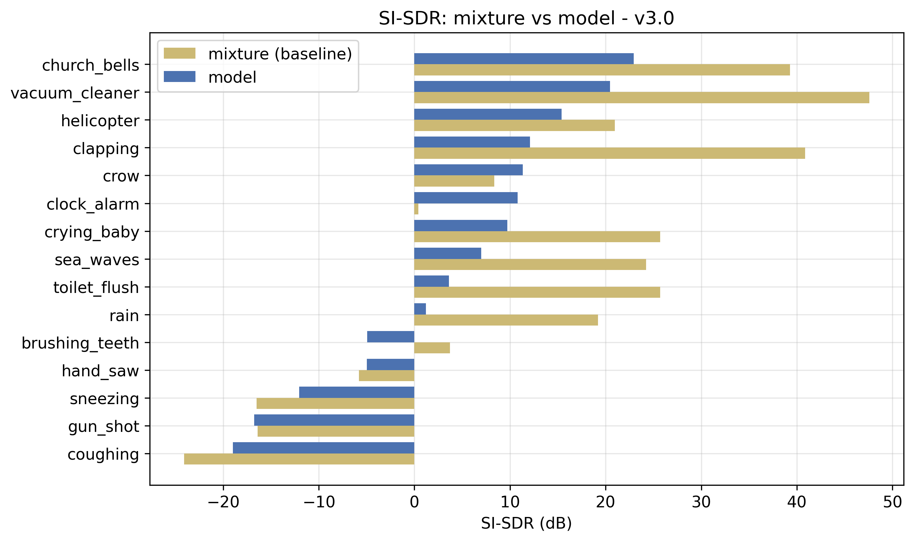
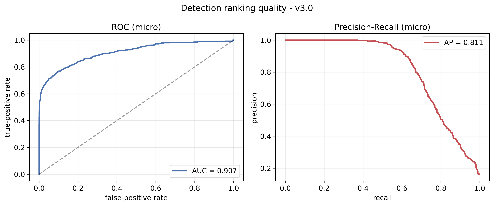

# 4. BULGULAR VE TARTIŞMA

Bu bölümde, önerilen sistemin başarımı niceliksel ve niteliksel olarak değerlendirilmiştir. Önce değerlendirme metrikleri tanımlanmış; ardından modelin v1.0'dan v3.0'a uzanan sürüm evrimi, her sürümde gözlemlenen başarısızlık örüntüleri ve bunlara getirilen çözümlerle birlikte çözümlenmiştir. Sonraki başlıklarda ayrıştırma başarımı, tespit başarımı, FiLM koşullandırmasının katkısı, eşik taraması ve niteliksel sonuçlar sunulmuş; bölüm, sistemin sınırlılıklarının tartışılmasıyla tamamlanmıştır. Niceliksel sonuçlar, modelin son sürümü (v3.0) için iki yüz sentetik karışımdan oluşan bir test kümesi üzerinde elde edilmiştir.

## 4.1 Değerlendirme Metodolojisi ve Metrikler

Sistem, ayrıştırma ve tespit olmak üzere iki ayrı görev için ayrı metriklerle değerlendirilmiştir. Değerlendirme, eğitimden bağımsız bir tohum değeriyle üretilen ve bileşen sınıfları bilinen sentetik karışımlar üzerinde yapılmıştır.

### 4.1.1 Ölçek-Değişmez İşaret-Bozulma Oranı

Ayrıştırma kalitesi, ölçek-değişmez işaret-bozulma oranı (Scale-Invariant Signal-to-Distortion Ratio, SI-SDR) ile ölçülmüştür [39]. SI-SDR, kestirilen kaynak $\hat{s}$ ile referans kaynak $s$ arasındaki benzerliği, ölçek farklılıklarına karşı duyarsız biçimde değerlendirmektedir. Ortalamaları çıkarılmış sinyaller için, referans yönündeki izdüşüm katsayısı

$$\alpha = \frac{\hat{s}^{\top} s}{\lVert s \rVert^{2}}$$

ile hesaplanmakta; hedef bileşeni $s_{\text{hedef}} = \alpha s$ ve bozulma bileşeni $e = \hat{s} - \alpha s$ olmak üzere ölçüt

$$\text{SI-SDR}(\hat{s}, s) = 10 \log_{10} \frac{\lVert \alpha s \rVert^{2}}{\lVert \hat{s} - \alpha s \rVert^{2}}$$

biçiminde tanımlanmaktadır. Başlıca sonuç değeri olan SI-SDRi (improvement), modelin kestirdiği stem'in SI-SDR değeri ile işlenmemiş karışımın ("hiçbir şey yapmama" temel çizgisinin) SI-SDR değeri arasındaki farktır:

$$\text{SI-SDRi} = \text{SI-SDR}(\hat{s}, s) - \text{SI-SDR}(x, s).$$

Pozitif bir SI-SDRi değeri, modelin işlenmemiş karışıma kıyasla bir iyileştirme sağladığını göstermektedir. SI-SDR ölçütü sessizliğe karşı tanımsız olduğundan, ayrıştırma değerlendirmesi yalnızca pozitif örnekler (sorgu sınıfının karışımda bulunduğu durumlar) üzerinde yapılmaktadır.

### 4.1.2 Tespit Metrikleri

Tespit başarımı, kesinlik (precision), duyarlılık (recall) ve bunların harmonik ortalaması olan $F_1$ ölçütüyle değerlendirilmiştir. Bir sınıf için doğru pozitif (DP), yanlış pozitif (YP) ve yanlış negatif (YN) sayıları üzerinden

$$\text{Kesinlik} = \frac{\text{DP}}{\text{DP} + \text{YP}}, \qquad \text{Duyarlılık} = \frac{\text{DP}}{\text{DP} + \text{YN}},$$

$$F_1 = \frac{2 \cdot \text{Kesinlik} \cdot \text{Duyarlılık}}{\text{Kesinlik} + \text{Duyarlılık}}$$

tanımları kullanılmaktadır. Genel başarım, sınıf bazlı $F_1$ değerlerinin ortalaması olan makro $F_1$ ile özetlenmektedir. Makro ortalama, her sınıfa eşit ağırlık verdiğinden, sınıf dengesizliğinden bağımsız bir başarım göstergesi sağlamaktadır. Her sentetik karışım için bileşen sınıfları bilindiğinden, tespit edilen sınıflar bu yer-gerçek (ground-truth) kümesiyle karşılaştırılarak DP, YP ve YN sayıları biriktirilmektedir.

## 4.2 Model Sürüm Evrimi

Önerilen model, tek bir eğitim turunda değil, her sürümde gözlemlenen başarısızlık örüntülerinin çözümlenip bir sonraki sürümün tasarımına yansıtıldığı iteratif bir süreçle geliştirilmiştir. Bu sürüm evrimi, hem nihai tasarım kararlarının gerekçelerini belgelemekte hem de derin öğrenme tabanlı bir ayrıştırma sisteminin geliştirilmesinde karşılaşılan tipik tuzakları ortaya koymaktadır. Sürümlerin başlıca değişiklikleri ve sonuçları Tablo 4.1'de özetlenmiştir.

**Tablo 4.1:** Model sürümlerinin evrimi, başlıca değişiklikler ve sonuçlar.

| Sürüm | Başlıca değişiklik | Sonuç |
|---|---|---|
| v1.0 | FiLM-koşullu U-Net + anlık karışım temel modeli (ESC-50) | Çalışan temel model |
| v2.0 | Agresif veri artırımı ($P_{\text{negatif}}=0{,}45$; SNR 5–20 dB) | Sessizliğe çöküş (bozuk) |
| v2.1 | Artırma düzeltmesi + çıkarım normalizasyonu | $F_1=0{,}21$; SI-SDRi $-22{,}18$ dB |
| v2.2 | Tam-kodlayıcı FiLM + çok çözünürlüklü L1 + %75 OLA | $F_1=0{,}13$ (FSD50K sıfır klip hatası) |
| v2.3 | $P_{\text{negatif}}=0{,}15$; FSD50K eklendi (235 sınıf) | $F_1=0{,}02$ (fantom yanlış pozitifler) |
| v2.4 | Minimum klip tabanı 40 + tespit izin listesi | $F_1=0{,}09$; çalışma noktası cap$=0{,}80$, $k=5$ |
| v2.6 | Öğrenilmiş tespit başı + 10 aşırı-tetikleyen sınıf | $F_1=0{,}17$ (baş yetersiz uyum) |
| v2.7 | $P_{\text{negatif}}=0{,}50$; büyük baş; odak kaybı | Gradyan çöküşü (başarısız) |
| v2.8 | BCE tespit + FSD50K kaldırıldı (56 sınıf) | $F_1=0{,}32$ |
| v3.0 | Düzenlenmiş 15 sınıflı sözcük dağarcığı | $F_1=0{,}692$; SI-SDRi $-13{,}07$ dB |

Temel model (v1.0), FiLM-koşullu U-Net mimarisini ve anlık karışım hattını kurmuş; tespit ve çıkarma işlevleri bu aşamada çalışır durumda olmuştur. İkinci sürüm (v2.0), veri artırımının agresif biçimde artırılmasıyla bütünüyle işlevsiz hâle gelmiştir: negatif örnek olasılığının $0{,}45$'e ve gürültü düzeyinin $5$ dB SNR'a çıkarılması, modeli her sorgu için yakın-sıfır maske üreten "güvenli sessizlik" dengesine itmiştir. Ayrıca çıkarım hattının ham ses beslemesi, eğitim-çıkarım ölçek uyumsuzluğunu açığa çıkarmıştır. Bu başarısızlık, üçüncü bölümde açıklanan negatif örnek oranı (Alt Başlık 3.4.2) ve tepe normalizasyonu (Alt Başlık 3.4.5) tasarım kararlarının doğrudan gerekçesini oluşturmaktadır.

İzleyen sürümler (v2.1–v2.2), artırma parametrelerini ölçülü değerlere çekmiş, çıkarım normalizasyonunu düzeltmiş, FiLM koşullandırmasını tüm kodlayıcı seviyelerine yaymış, çok çözünürlüklü L1 kaybını eklemiş ve örtüşme oranını $\%75$'e çıkararak sınır darbesi yapaylığını gidermiştir. FSD50K veri kümesinin eklenmesi (v2.3), sözcük dağarcığını $235$ sınıfa genişletmiş; ancak yerel sesle desteklenmeyen sınıfların fantom yanlış pozitifler üretmesiyle makro $F_1$ değeri $0{,}02$'ye gerilemiştir. Bu çöküş, minimum klip tabanının (v2.4) ve sonunda FSD50K'nin bütünüyle kaldırılmasının (v2.8) gerekçesini oluşturmuştur.

Tespit probleminin maske-enerjisi sezgiseliyle yapısal olarak çözülemeyeceğinin anlaşılması üzerine, öğrenilmiş bir tespit başı eklenmiştir (v2.6). Bu başın odak kaybıyla eğitilmesi (v2.7), Alt Başlık 3.6.2'de çözümlenen gradyan çöküşüne yol açmış; ikili çapraz entropiye dönülmesi ve FSD50K'nin kaldırılmasıyla (v2.8) makro $F_1$ değeri $0{,}32$'ye yükselmiştir. Bu sürümün sınıf bazlı sonuçlarının belirgin biçimde iki kutuplu olması — bir grup sınıfın yüksek, geniş bantlı bir grup sınıfın ise sıfıra yakın $F_1$ üretmesi — son sürümün (v3.0) tasarım ilkesini belirlemiştir: ayrıştırma ve tespit başarımının en yüksek olduğu on beş sınıfın korunması. Bu düzenleme, hem makro ortalamayı yalnızca başarılı sınıflar üzerinden hesaplatmış hem de aşırı-tetikleyen geniş bantlı sınıfları aday havuzundan çıkararak göreli kesme eşiğinin gerçek sınıfları bastırmasını önlemiştir. Sonuçta makro $F_1$ değeri $0{,}692$'ye ulaşmıştır.

## 4.3 Ayrıştırma Başarımı

Modelin son sürümünde ortalama SI-SDRi değeri $-13{,}07$ dB olarak ölçülmüştür. Bu değerin negatif olması, ilk bakışta modelin işlenmemiş karışıma kıyasla bir iyileştirme sağlamadığını düşündürse de, sınıf bazlı ve karışım-bazlı çözümleme daha incelikli bir tabloyu ortaya koymaktadır. Sınıf bazlı SI-SDRi değerleri Şekil 4.1'de, işlenmemiş karışım ile modelin kestirimine ait SI-SDR değerlerinin karşılaştırması ise Şekil 4.2'de gösterilmiştir.

**Şekil 4.1:** v3.0 sürümünün sınıf bazlı SI-SDRi değerleri.

**Şekil 4.2:** İşlenmemiş karışım (SI-SDR mix) ile model kestiriminin (SI-SDR model) sınıf bazlı karşılaştırması.

Sınıf bazlı çözümleme, SI-SDRi değerinin sınıflar arasında geniş bir aralığa yayıldığını göstermektedir. Bir grup sınıf pozitif SI-SDRi üretmektedir: çalar saat ($+10{,}39$ dB), öksürük ($+5{,}12$ dB), hapşırık ($+4{,}43$ dB), karga ($+2{,}99$ dB) ve el testeresi ($+0{,}85$ dB). Buna karşılık bazı sınıflar belirgin biçimde negatif değerler vermektedir: alkış ($-28{,}79$ dB), elektrikli süpürge ($-27{,}12$ dB) ve sifon ($-22{,}08$ dB).

Bu dağılımın temel nedeni, SI-SDR ölçütünün karışımdaki hedef baskınlığına olan duyarlılığıdır. İşlenmemiş karışımın SI-SDR değeri zaten yüksek olan, yani hedef kaynağın karışıma hâkim olduğu örneklerde (örneğin elektrikli süpürge için işlenmemiş karışımın SI-SDR değeri $47{,}59$ dB'dir), herhangi bir spektrogram maskeleme işlemi dalga biçimi düzeyindeki SI-SDR değerini düşürmektedir; çünkü hedef hâlihazırda neredeyse izole hâldedir ve maske ancak hata ekleyebilir. Tersine, hedefin karışım içinde gömülü olduğu örneklerde (örneğin çalar saat için işlenmemiş karışımın SI-SDR değeri $0{,}42$ dB'dir, model bunu $10{,}80$ dB'ye çıkarmaktadır) model belirgin bir iyileştirme sağlamaktadır. Dolayısıyla negatif ortalama SI-SDRi, modelin başarısızlığından çok, test kümesindeki hedef-baskın karışımların ağırlığını ve seçilen ölçütün dalga biçimi-düzeyli doğasını yansıtmaktadır. Ek olarak SI-SDR, izole stem'in dalga biçimi yeniden yapılandırma kalitesini ölçtüğünden, faz yeniden kullanımıyla (Alt Başlık 3.8.4) yapısal olarak sınırlanmaktadır; web uygulamasında algılanan ve çıkarma sonrası artığa dayanan algısal kalite, bu ölçütle birebir yakalanmamaktadır.

## 4.4 Tespit Başarımı

Modelin son sürümünde tespit makro $F_1$ değeri $0{,}692$ olarak ölçülmüş; toplam doğru pozitif, yanlış pozitif ve yanlış negatif sayıları sırasıyla $433$, $34$ ve $299$ olarak elde edilmiştir. Sınıf bazlı kesinlik, duyarlılık ve $F_1$ değerleri Şekil 4.3'te, toplam DP/YP/YN dağılımı ise Şekil 4.4'te gösterilmiştir. Sınıf bazlı kesinlik, duyarlılık, $F_1$ ve SI-SDRi değerleri Tablo 4.2'de bir arada sunulmuştur.

**Şekil 4.3:** v3.0 sürümünün sınıf bazlı kesinlik, duyarlılık ve $F_1$ değerleri.

**Şekil 4.4:** Toplam doğru pozitif, yanlış pozitif ve yanlış negatif sayıları.

**Tablo 4.2:** v3.0 sürümünün sınıf bazlı tespit ve ayrıştırma başarımı.

| Sınıf | Kesinlik | Duyarlılık | $F_1$ | SI-SDRi (dB) |
|---|---|---|---|---|
| clock_alarm | 1,00 | 0,89 | 0,939 | +10,39 |
| helicopter | 0,97 | 0,90 | 0,933 | −5,54 |
| vacuum_cleaner | 0,98 | 0,87 | 0,918 | −27,12 |
| church_bells | 0,91 | 0,89 | 0,903 | −16,35 |
| hand_saw | 0,97 | 0,73 | 0,831 | +0,85 |
| clapping | 0,96 | 0,67 | 0,788 | −28,79 |
| crying_baby | 0,92 | 0,68 | 0,783 | −16,00 |
| sea_waves | 0,90 | 0,63 | 0,740 | −17,23 |
| crow | 0,97 | 0,53 | 0,686 | +2,99 |
| rain | 0,90 | 0,54 | 0,675 | −18,03 |
| brushing_teeth | 1,00 | 0,44 | 0,611 | −8,65 |
| gun_shot | 0,74 | 0,46 | 0,567 | −0,37 |
| toilet_flush | 0,89 | 0,38 | 0,531 | −22,08 |
| coughing | 0,80 | 0,17 | 0,281 | +5,12 |
| sneezing | 0,55 | 0,12 | 0,197 | +4,43 |

Sonuçlar, tespit başının yüksek kesinlikli ancak tutucu bir çalışma noktasında olduğunu göstermektedir. Kesinlik değerleri çoğu sınıfta $0{,}90$ ve üzerindedir; toplam yanlış pozitif sayısının yalnızca $34$ olması, modelin nadiren sahte tespit ürettiğini ortaya koymaktadır. Buna karşılık duyarlılık, başarımı sınırlayan baskın etmendir; toplam yanlış negatif sayısının $299$ olması, modelin bazı gerçek sınıfları kaçırdığını göstermektedir. En düşük duyarlılık, kısa süreli ve geçici (transient) sesler olan hapşırık ($0{,}12$) ve öksürük ($0{,}17$) sınıflarında gözlemlenmektedir; bu sınıflar hem düşük enerjili hem de akustik olarak benzer olduklarından, tespit başının bu sınıflar için güvenli bir varlık olasılığı üretmesi güçleşmektedir. Çalar saat, helikopter ve elektrikli süpürge gibi sürekli ve ayırt edici tınıya sahip sınıflar ise $0{,}90$'ı aşan $F_1$ değerleriyle en başarılı sınıflardır. Tespit puanlarının alıcı işletim karakteristiği (ROC) ve kesinlik-duyarlılık (PR) eğrileri Şekil 4.5'te sunulmuştur.

**Şekil 4.5:** Tespit başının ROC ve kesinlik-duyarlılık eğrileri.

## 4.5 FiLM Koşullandırmasının Katkısı

FiLM koşullandırmasının ayrıştırmaya katkısı, doğru sınıf sorgulandığında üretilen çıkış enerjisi ile yanlış sınıf sorgulandığında üretilen çıkış enerjisinin oranıyla (ayrımcılık üstünlüğü, advantage) değerlendirilmiştir. Yüksek bir oran, modelin sorgulanan sınıfa göre çıktısını güçlü biçimde farklılaştırdığını, yani koşullandırmanın etkin çalıştığını göstermektedir. Sınıf bazlı ayrımcılık üstünlüğü Şekil 4.6'da, çıkış-giriş enerji oranı ise Şekil 4.7'de gösterilmiştir.

**Şekil 4.6:** FiLM koşullandırmasının sınıf bazlı ayrımcılık üstünlüğü (doğru sorgu / yanlış sorgu enerji oranı).

**Şekil 4.7:** Sınıf bazlı çıkış-giriş enerji oranı.

Çoğu sınıfta, doğru sorgu yüksek bir çıkış enerjisi üretirken yanlış sorgu yakın-sıfır enerji üretmektedir; örneğin diş fırçalama sınıfında doğru sorgunun enerjisi $8{,}43$, yanlış sorgunun enerjisi ise $1{,}58 \times 10^{-5}$ mertebesindedir; bu da yüz binleri aşan bir ayrımcılık üstünlüğüne karşılık gelmektedir. Deniz dalgaları ve elektrikli süpürge gibi sınıflarda bu oran milyonlar mertebesine ulaşmaktadır. Bu sonuç, çok seviyeli FiLM koşullandırmasının (Alt Başlık 3.5.4) modelin sorgulanan sınıfa göre seçici davranmasını sağladığını doğrulamaktadır. Görece zayıf bir durum, doğru ve yanlış sorgu enerjilerinin birbirine yakın olduğu (üstünlük $\approx 6{,}66$) helikopter sınıfında gözlemlenmektedir; bu sınıfta yanlış sorgu da kayda değer bir enerji üretmekte, ancak sınıfın yüksek tespit $F_1$ değeri ($0{,}933$) genel başarımı korumaktadır.