# 4. BULGULAR VE TARTIŞMA

Bu bölümde, önerilen sistemin başarımı niceliksel ve niteliksel olarak değerlendirilmiştir. Önce değerlendirme metrikleri tanımlanmış; ardından nihai yapılandırmaya yol açan tasarım kararları, kendilerine yol açan deneysel gözlemler ve başarısızlık örüntüleriyle birlikte çözümlenmiştir. Sonraki başlıklarda ayrıştırma başarımı, tespit başarımı, FiLM koşullandırmasının katkısı, eşik taraması ve niteliksel sonuçlar sunulmuş; bölüm, sistemin sınırlılıklarının tartışılmasıyla tamamlanmıştır. Niceliksel sonuçlar, önerilen model için iki yüz sentetik karışımdan oluşan bir test kümesi üzerinde elde edilmiştir.

## 4.1 Değerlendirme Metodolojisi ve Metrikler

Sistem, ayrıştırma ve tespit olmak üzere iki ayrı görev için ayrı metriklerle değerlendirilmiştir. Değerlendirme, eğitimden bağımsız bir tohum değeriyle üretilen ve bileşen sınıfları bilinen sentetik karışımlar üzerinde yapılmıştır.

### 4.1.1 Ölçek-Değişmez İşaret-Bozulma Oranı

Ayrıştırma kalitesi, ölçek-değişmez işaret-bozulma oranı (Scale-Invariant Signal-to-Distortion Ratio, SI-SDR) ile ölçülmüştür [39]. SI-SDR, kestirilen kaynak $\hat{s}$ ile referans kaynak $s$ arasındaki benzerliği, ölçek farklılıklarına karşı duyarsız biçimde değerlendirmektedir. Ortalamaları çıkarılmış sinyaller için, referans yönündeki izdüşüm katsayısı

$$\alpha = \frac{\hat{s}^{\top} s}{\lVert s \rVert^{2}}$$

ile hesaplanmakta; hedef bileşeni $s_{\text{hedef}} = \alpha s$ ve bozulma bileşeni $e = \hat{s} - \alpha s$ olmak üzere ölçüt

$$\text{SI-SDR}(\hat{s}, s) = 10 \log_{10} \frac{\lVert \alpha s \rVert^{2}}{\lVert \hat{s} - \alpha s \rVert^{2}}$$

biçiminde tanımlanmaktadır. Başlıca sonuç değeri olan SI-SDRi (improvement), modelin kestirdiği stem'in SI-SDR değeri ile işlenmemiş karışımın ("hiçbir şey yapmama" temel çizgisinin) SI-SDR değeri arasındaki farktır:

$$\text{SI-SDRi} = \text{SI-SDR}(\hat{s}, s) - \text{SI-SDR}(x, s).$$

Pozitif bir SI-SDRi değeri, modelin işlenmemiş karışıma kıyasla bir iyileştirme sağladığını göstermektedir. SI-SDR ölçütü sessizliğe karşı tanımsız olduğundan, ayrıştırma değerlendirmesi yalnızca pozitif örnekler (sorgu sınıfının karışımda bulunduğu durumlar) üzerinde yapılmaktadır.

SI-SDR'nin ölçek-değişmezliği, hedef bileşeninin kestirim üzerine dik izdüşümünden kaynaklanmaktadır. $\alpha = \hat{s}^{\top}s / \lVert s \rVert^{2}$ katsayısı, $\hat{s}$ vektörünü $s$ doğrultusuna izdüşüren en küçük kareler çözümüdür; bu seçim, hedef bileşeni $s_{\text{hedef}} = \alpha s$ ile bozulma bileşeni $e = \hat{s} - \alpha s$ vektörlerini birbirine dik kılmaktadır ($s_{\text{hedef}}^{\top} e = 0$). Kestirimin sabit bir $\kappa$ katsayısıyla ölçeklenmesi ($\hat{s} \to \kappa\hat{s}$), hem $s_{\text{hedef}}$ hem de $e$ bileşenlerini aynı $\kappa$ katıyla büyüttüğünden, ikisinin güç oranı ve dolayısıyla SI-SDR değeri değişmeden kalmaktadır. Bu özellik, ölçütün modelin genel bir kazanç (ölçek) hatasından etkilenmemesini; bunun yerine yalnızca hedefin spektro-zamansal yapısının ne ölçüde geri kazanıldığını ölçmesini sağlamaktadır.

### 4.1.2 Tespit Metrikleri

Tespit başarımı, kesinlik (precision), duyarlılık (recall) ve bunların harmonik ortalaması olan $F_1$ ölçütüyle değerlendirilmiştir. Bir sınıf için doğru pozitif (DP), yanlış pozitif (YP) ve yanlış negatif (YN) sayıları üzerinden

$$\text{Kesinlik} = \frac{\text{DP}}{\text{DP} + \text{YP}}, \qquad \text{Duyarlılık} = \frac{\text{DP}}{\text{DP} + \text{YN}},$$

$$F_1 = \frac{2 \cdot \text{Kesinlik} \cdot \text{Duyarlılık}}{\text{Kesinlik} + \text{Duyarlılık}}$$

tanımları kullanılmaktadır. Genel başarım, sınıf bazlı $F_1$ değerlerinin ortalaması olan makro $F_1$ ile özetlenmektedir. Makro ortalama, her sınıfa eşit ağırlık verdiğinden, sınıf dengesizliğinden bağımsız bir başarım göstergesi sağlamaktadır. Her sentetik karışım için bileşen sınıfları bilindiğinden, tespit edilen sınıflar bu yer-gerçek (ground-truth) kümesiyle karşılaştırılarak DP, YP ve YN sayıları biriktirilmektedir.

## 4.2 Tasarım Kararlarının Deneysel Gerekçeleri

Önerilen modelin nihai yapılandırması, tek bir tasarım turunda değil, bir dizi denetimli deneyin gözlemlerine dayanarak belirlenmiştir. Bu alt başlıkta, başlıca tasarım kararları, kendilerine yol açan deneysel gözlemlerle birlikte sunulmuştur. Söz konusu gözlemler, derin öğrenme tabanlı bir ayrıştırma sisteminin geliştirilmesinde karşılaşılan tipik tuzakları da ortaya koymaktadır. Denenen başlıca değişiklikler ve gözlemlenen sonuçlar Tablo 4.1'de özetlenmiştir.

**Tablo 4.1:** Denenen tasarım değişiklikleri ve gözlemlenen sonuçlar.

| Denenen değişiklik | Gözlemlenen sonuç |
|---|---|
| Agresif veri artırımı ($P_{\text{negatif}}=0{,}45$; SNR 5–20 dB) | Sessizliğe çöküş |
| Artırma parametrelerinin ölçülü değerlere çekilmesi + çıkarım normalizasyonu | $F_1=0{,}21$; SI-SDRi $-22{,}18$ dB |
| Tam-kodlayıcı FiLM + çok çözünürlüklü L1 + %75 örtüşme | Sınır darbesi yapaylığı giderildi |
| Geniş dış veri kümesinin eklenmesi (235 sınıf) | $F_1=0{,}02$ (fantom yanlış pozitifler) |
| Minimum klip tabanı + tespit izin listesi | $F_1=0{,}09$; çalışma noktası cap$=0{,}80$, $k=5$ |
| Maske-enerjisi yerine öğrenilmiş tespit başı | $F_1=0{,}17$ (baş yetersiz uyum) |
| Tespit kaybında odak kaybı (focal loss) | Gradyan çöküşü |
| BCE tespit kaybı + dış veri kümesinin kaldırılması (56 sınıf) | $F_1=0{,}32$ |
| Düzenlenmiş 15 sınıflı sözcük dağarcığı | $F_1=0{,}692$; SI-SDRi $-13{,}07$ dB |

**Veri artırımının dengelenmesi.** Veri artırımının agresif biçimde uygulanması — negatif örnek olasılığının $0{,}45$'e ve gürültü düzeyinin $5$ dB SNR'a çıkarılması — modeli her sorgu için yakın-sıfır maske üreten "güvenli sessizlik" dengesine iterek bütünüyle işlevsiz kılmıştır. Bu gözlem, negatif örnek oranının (Alt Başlık 3.4.2) ölçülü bir değerde tutulması ve gürültü SNR aralığının gerçekçi düzeylere ($15$–$30$ dB) çekilmesi kararının doğrudan gerekçesidir. Buna ek olarak, çıkarım hattının ham (normalize edilmemiş) ses beslemesi, eğitim-çıkarım ölçek uyumsuzluğunu açığa çıkarmış ve tepe normalizasyonunun (Alt Başlık 3.4.5) çıkarım hattında birebir uygulanması gerekliliğini ortaya koymuştur.

**Mimari ve kayıp iyileştirmeleri.** FiLM koşullandırmasının tüm kodlayıcı seviyelerine yayılması, çok çözünürlüklü L1 kaybının eklenmesi ve örtüşme oranının $\%75$'e çıkarılması; sırasıyla maske kesinliğini artırmış, spektral biçim yakınsamasını kararlı kılmış ve parça sınırlarındaki darbeli yapaylığı gidermiştir.

**Sözcük dağarcığı ve yanlış pozitifler.** Geniş bir dış veri kümesinin eklenmesi, sözcük dağarcığını yüzlerce sınıfa genişletmiş; ancak yerel sesle desteklenmeyen sınıfların fantom yanlış pozitifler üretmesiyle makro $F_1$ değeri $0{,}02$'ye gerilemiştir. Bu çöküş, önce sınıf başına minimum klip tabanının uygulanmasının, ardından bu dış veri kümesinin bütünüyle kaldırılmasının gerekçesini oluşturmuştur.

**Öğrenilmiş tespit ve kayıp seçimi.** Tespit probleminin maske-enerjisi sezgiseliyle yapısal olarak çözülemeyeceğinin anlaşılması üzerine, öğrenilmiş bir tespit başı eklenmiştir. Bu başın odak kaybıyla (focal loss) eğitilmesi denendiğinde, Alt Başlık 3.6.2'de çözümlenen gradyan çöküşü gözlemlenmiş; başın çıkışı her sınıf için yaklaşık $0{,}5$ değerine çökmüştür. İkili çapraz entropiye dönülmesi ve dış veri kümesinin kaldırılmasıyla makro $F_1$ değeri $0{,}32$'ye yükselmiştir.

**Düzenlenmiş sözcük dağarcığı.** Bu aşamadaki sınıf bazlı sonuçların belirgin biçimde iki kutuplu olması — bir grup sınıfın yüksek, geniş bantlı bir grup sınıfın ise sıfıra yakın $F_1$ üretmesi — nihai tasarım ilkesini belirlemiştir: ayrıştırma ve tespit başarımının en yüksek olduğu on beş sınıfın korunması. Bu düzenleme, hem makro ortalamayı yalnızca başarılı sınıflar üzerinden hesaplatmış hem de aşırı-tetikleyen geniş bantlı sınıfları aday havuzundan çıkararak göreli kesme eşiğinin gerçek sınıfları bastırmasını önlemiştir. Sonuçta makro $F_1$ değeri $0{,}692$'ye ulaşmıştır.

## 4.3 Ayrıştırma Başarımı

Önerilen modelde ortalama SI-SDRi değeri $-13{,}07$ dB olarak ölçülmüştür. Bu değerin negatif olması, ilk bakışta modelin işlenmemiş karışıma kıyasla bir iyileştirme sağlamadığını düşündürse de, sınıf bazlı ve karışım-bazlı çözümleme daha incelikli bir tabloyu ortaya koymaktadır. Sınıf bazlı SI-SDRi değerleri Şekil 4.1'de, işlenmemiş karışım ile modelin kestirimine ait SI-SDR değerlerinin karşılaştırması ise Şekil 4.2'de gösterilmiştir.

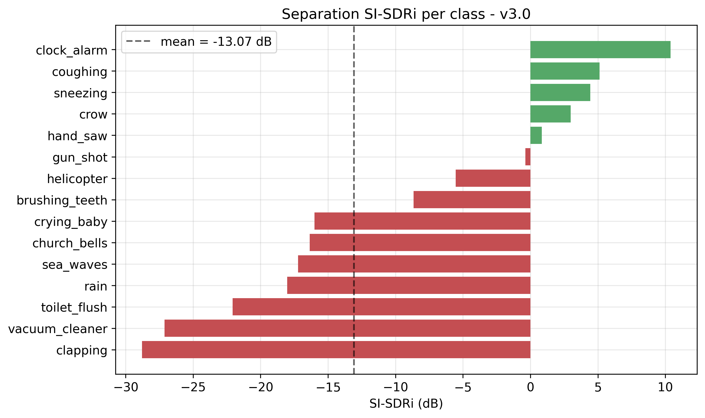

**Şekil 4.1:** Sınıf bazlı SI-SDRi değerleri.

**Şekil 4.2:** İşlenmemiş karışım (SI-SDR mix) ile model kestiriminin (SI-SDR model) sınıf bazlı karşılaştırması.

Sınıf bazlı çözümleme, SI-SDRi değerinin sınıflar arasında geniş bir aralığa yayıldığını göstermektedir. Bir grup sınıf pozitif SI-SDRi üretmektedir: çalar saat ($+10{,}39$ dB), öksürük ($+5{,}12$ dB), hapşırık ($+4{,}43$ dB), karga ($+2{,}99$ dB) ve el testeresi ($+0{,}85$ dB). Buna karşılık bazı sınıflar belirgin biçimde negatif değerler vermektedir: alkış ($-28{,}79$ dB), elektrikli süpürge ($-27{,}12$ dB) ve sifon ($-22{,}08$ dB).

Bu dağılımın temel nedeni, SI-SDR ölçütünün karışımdaki hedef baskınlığına olan duyarlılığıdır. İşlenmemiş karışımın SI-SDR değeri zaten yüksek olan, yani hedef kaynağın karışıma hâkim olduğu örneklerde (örneğin elektrikli süpürge için işlenmemiş karışımın SI-SDR değeri $47{,}59$ dB'dir), herhangi bir spektrogram maskeleme işlemi dalga biçimi düzeyindeki SI-SDR değerini düşürmektedir; çünkü hedef hâlihazırda neredeyse izole hâldedir ve maske ancak hata ekleyebilir. Tersine, hedefin karışım içinde gömülü olduğu örneklerde (örneğin çalar saat için işlenmemiş karışımın SI-SDR değeri $0{,}42$ dB'dir, model bunu $10{,}80$ dB'ye çıkarmaktadır) model belirgin bir iyileştirme sağlamaktadır. Dolayısıyla negatif ortalama SI-SDRi, modelin başarısızlığından çok, test kümesindeki hedef-baskın karışımların ağırlığını ve seçilen ölçütün dalga biçimi-düzeyli doğasını yansıtmaktadır. Ek olarak SI-SDR, izole stem'in dalga biçimi yeniden yapılandırma kalitesini ölçtüğünden, faz yeniden kullanımıyla (Alt Başlık 3.8.4) yapısal olarak sınırlanmaktadır; web uygulamasında algılanan ve çıkarma sonrası artığa dayanan algısal kalite, bu ölçütle birebir yakalanmamaktadır.

## 4.4 Tespit Başarımı

Önerilen modelde tespit makro $F_1$ değeri $0{,}692$ olarak ölçülmüş; toplam doğru pozitif, yanlış pozitif ve yanlış negatif sayıları sırasıyla $433$, $34$ ve $299$ olarak elde edilmiştir. Sınıf bazlı kesinlik, duyarlılık ve $F_1$ değerleri Şekil 4.3'te, toplam DP/YP/YN dağılımı ise Şekil 4.4'te gösterilmiştir. Sınıf bazlı kesinlik, duyarlılık, $F_1$ ve SI-SDRi değerleri Tablo 4.2'de bir arada sunulmuştur.

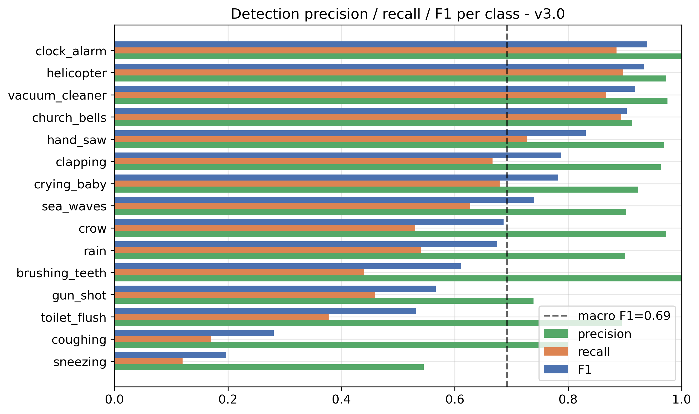

**Şekil 4.3:** Sınıf bazlı kesinlik, duyarlılık ve $F_1$ değerleri.

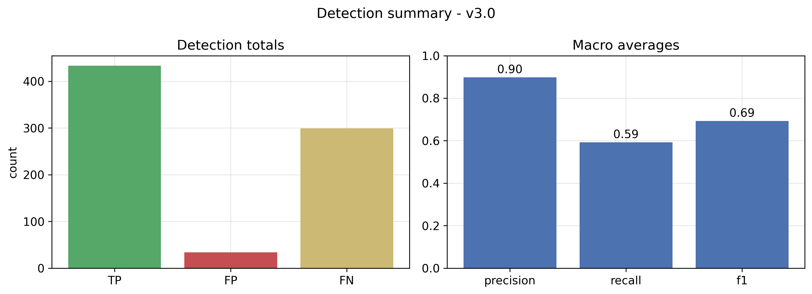

**Şekil 4.4:** Toplam doğru pozitif, yanlış pozitif ve yanlış negatif sayıları.

**Tablo 4.2:** Sınıf bazlı tespit ve ayrıştırma başarımı.

| Sınıf | Kesinlik | Duyarlılık | $F_1$ | SI-SDRi (dB) |
|---|---|---|---|---|
| clock_alarm | 1,00 | 0,89 | 0,939 | +10,39 |
| helicopter | 0,97 | 0,90 | 0,933 | −5,54 |
| vacuum_cleaner | 0,98 | 0,87 | 0,918 | −27,12 |
| church_bells | 0,91 | 0,89 | 0,903 | −16,35 |
| hand_saw | 0,97 | 0,73 | 0,831 | +0,85 |
| clapping | 0,96 | 0,67 | 0,788 | −28,79 |
| crying_baby | 0,92 | 0,68 | 0,783 | −16,00 |
| sea_waves | 0,90 | 0,63 | 0,740 | −17,23 |
| crow | 0,97 | 0,53 | 0,686 | +2,99 |
| rain | 0,90 | 0,54 | 0,675 | −18,03 |
| brushing_teeth | 1,00 | 0,44 | 0,611 | −8,65 |
| gun_shot | 0,74 | 0,46 | 0,567 | −0,37 |
| toilet_flush | 0,89 | 0,38 | 0,531 | −22,08 |
| coughing | 0,80 | 0,17 | 0,281 | +5,12 |
| sneezing | 0,55 | 0,12 | 0,197 | +4,43 |

Sonuçlar, tespit başının yüksek kesinlikli ancak tutucu bir çalışma noktasında olduğunu göstermektedir. Kesinlik değerleri çoğu sınıfta $0{,}90$ ve üzerindedir; toplam yanlış pozitif sayısının yalnızca $34$ olması, modelin nadiren sahte tespit ürettiğini ortaya koymaktadır. Buna karşılık duyarlılık, başarımı sınırlayan baskın etmendir; toplam yanlış negatif sayısının $299$ olması, modelin bazı gerçek sınıfları kaçırdığını göstermektedir. En düşük duyarlılık, kısa süreli ve geçici (transient) sesler olan hapşırık ($0{,}12$) ve öksürük ($0{,}17$) sınıflarında gözlemlenmektedir; bu sınıflar hem düşük enerjili hem de akustik olarak benzer olduklarından, tespit başının bu sınıflar için güvenli bir varlık olasılığı üretmesi güçleşmektedir. Çalar saat, helikopter ve elektrikli süpürge gibi sürekli ve ayırt edici tınıya sahip sınıflar ise $0{,}90$'ı aşan $F_1$ değerleriyle en başarılı sınıflardır. Tespit puanlarının alıcı işletim karakteristiği (ROC) ve kesinlik-duyarlılık (PR) eğrileri Şekil 4.5'te sunulmuştur.

**Şekil 4.5:** Tespit başının ROC ve kesinlik-duyarlılık eğrileri.

## 4.5 FiLM Koşullandırmasının Katkısı

FiLM koşullandırmasının ayrıştırmaya katkısı, doğru sınıf sorgulandığında üretilen çıkış enerjisi ile yanlış sınıf sorgulandığında üretilen çıkış enerjisinin oranıyla (ayrımcılık üstünlüğü, advantage) değerlendirilmiştir. Yüksek bir oran, modelin sorgulanan sınıfa göre çıktısını güçlü biçimde farklılaştırdığını, yani koşullandırmanın etkin çalıştığını göstermektedir. Sınıf bazlı ayrımcılık üstünlüğü Şekil 4.6'da, çıkış-giriş enerji oranı ise Şekil 4.7'de gösterilmiştir.

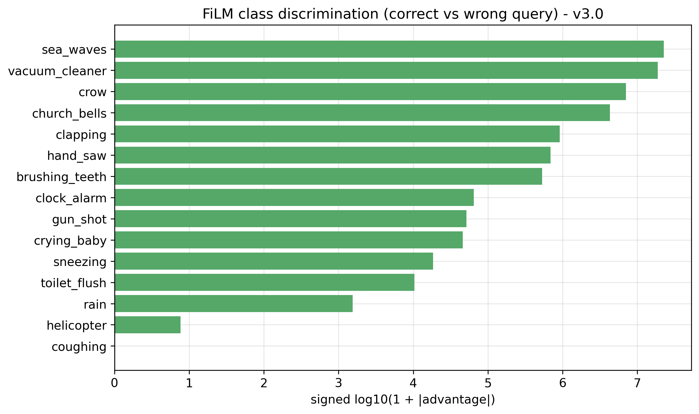

**Şekil 4.6:** FiLM koşullandırmasının sınıf bazlı ayrımcılık üstünlüğü (doğru sorgu / yanlış sorgu enerji oranı).

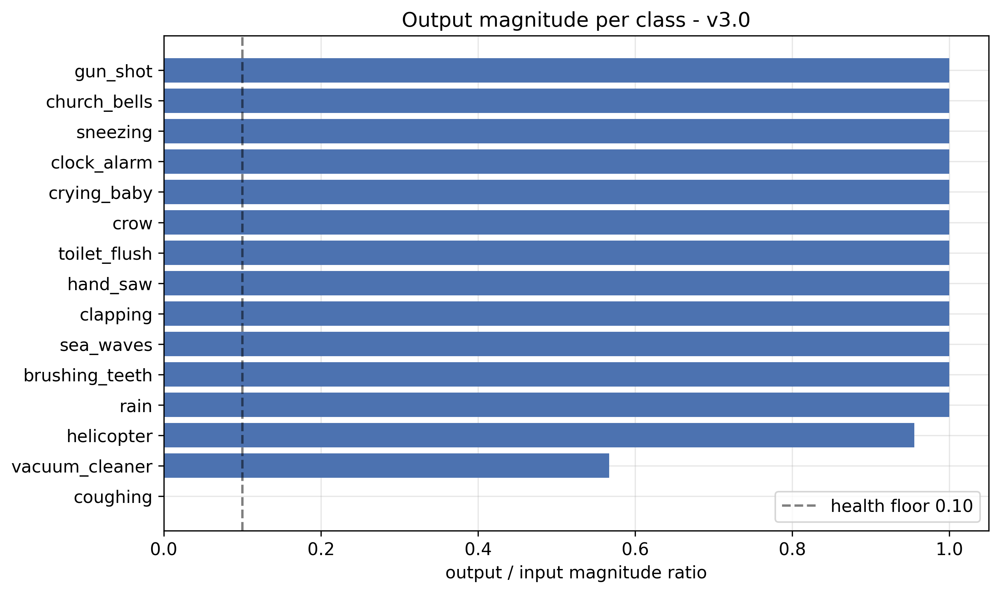

**Şekil 4.7:** Sınıf bazlı çıkış-giriş enerji oranı.

Çoğu sınıfta, doğru sorgu yüksek bir çıkış enerjisi üretirken yanlış sorgu yakın-sıfır enerji üretmektedir; örneğin diş fırçalama sınıfında doğru sorgunun enerjisi $8{,}43$, yanlış sorgunun enerjisi ise $1{,}58 \times 10^{-5}$ mertebesindedir; bu da yüz binleri aşan bir ayrımcılık üstünlüğüne karşılık gelmektedir. Deniz dalgaları ve elektrikli süpürge gibi sınıflarda bu oran milyonlar mertebesine ulaşmaktadır. Bu sonuç, çok seviyeli FiLM koşullandırmasının (Alt Başlık 3.5.4) modelin sorgulanan sınıfa göre seçici davranmasını sağladığını doğrulamaktadır. Görece zayıf bir durum, doğru ve yanlış sorgu enerjilerinin birbirine yakın olduğu (üstünlük $\approx 6{,}66$) helikopter sınıfında gözlemlenmektedir; bu sınıfta yanlış sorgu da kayda değer bir enerji üretmekte, ancak sınıfın yüksek tespit $F_1$ değeri ($0{,}933$) genel başarımı korumaktadır.

## 4.6 Eşik Taraması ve Çalışma Noktası Seçimi

Tespit aşamasında hangi sınıfların yüzeye çıkarılacağı, üç parametreyle denetlenmektedir: mutlak taban, kazanan sınıf puanına göre belirlenen göreli kesme ve yüzeye çıkarılacak en çok sınıf sayısı ($k$). Bu parametrelerin uygun çalışma noktası, bir ızgara taramasıyla belirlenmiştir. Tarama sonuçları Şekil 4.8'de, tespit puanlarının dağılımı Şekil 4.9'da ve en sık yanlış pozitif üreten sınıflar Şekil 4.10'da gösterilmiştir.

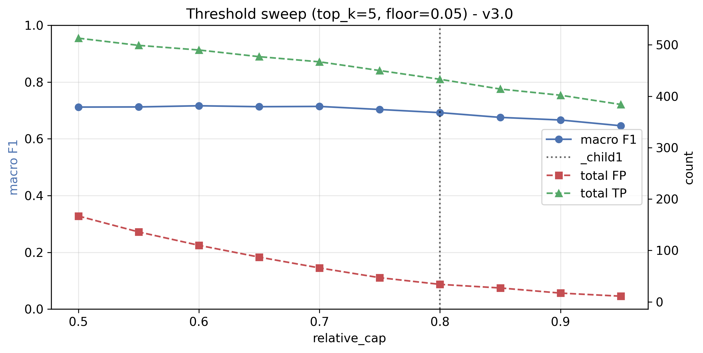

**Şekil 4.8:** Göreli kesme ve $k$ parametrelerinin makro $F_1$ üzerindeki etkisini gösteren eşik taraması.

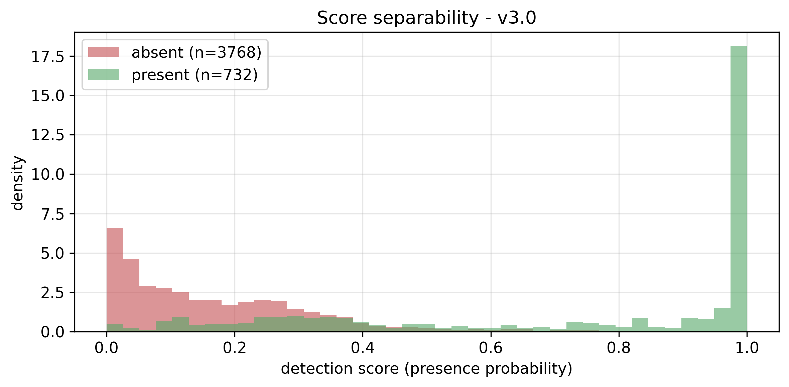

**Şekil 4.9:** Mevcut ve mevcut olmayan sınıflar için tespit puanlarının dağılımı.

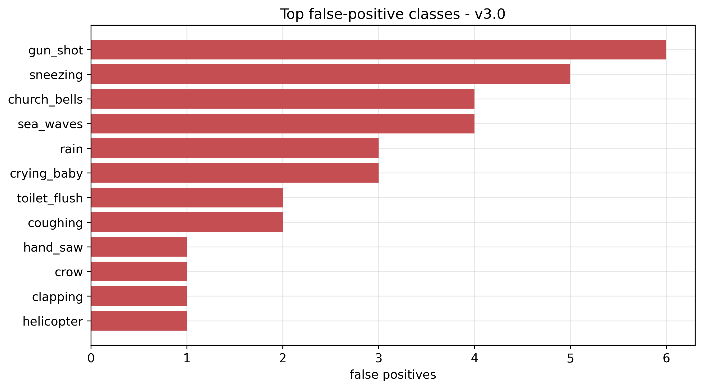

**Şekil 4.10:** En sık yanlış pozitif üreten sınıflar.

Tarama, göreli kesme eşiğinin yükseltilmesinin yanlış pozitifleri azaltmakla birlikte doğru pozitifleri de düşürdüğünü, dolayısıyla kesinlik ile duyarlılık arasında doğrudan bir ödünleşim bulunduğunu göstermektedir. Yürütülen eşik taramalarında, gevşek bir kesme (göreli kesme $0{,}65$, $k = 10$) daha çok doğru pozitif ancak yüksek yanlış pozitif; sıkı bir kesme (göreli kesme $0{,}90$, $k = 5$) ise az yanlış pozitif ancak çok sayıda kaçırılan sınıf üretmiştir. Bu uçların arasında, mutlak taban $0{,}05$, göreli kesme $0{,}80$ ve $k = 5$ değerleriyle tanımlanan çalışma noktası, en az sahte yüzeyleme ile kabul edilebilir bir duyarlılığı sağlayan ayar olarak seçilmiş ve hem web uygulamasında hem de değerlendirmede varsayılan olarak benimsenmiştir. Sınıfların birlikte tespit edilme örüntüleri Şekil 4.11'deki eş-zamanlı görünüm (co-occurrence) matrisinde sunulmuştur.

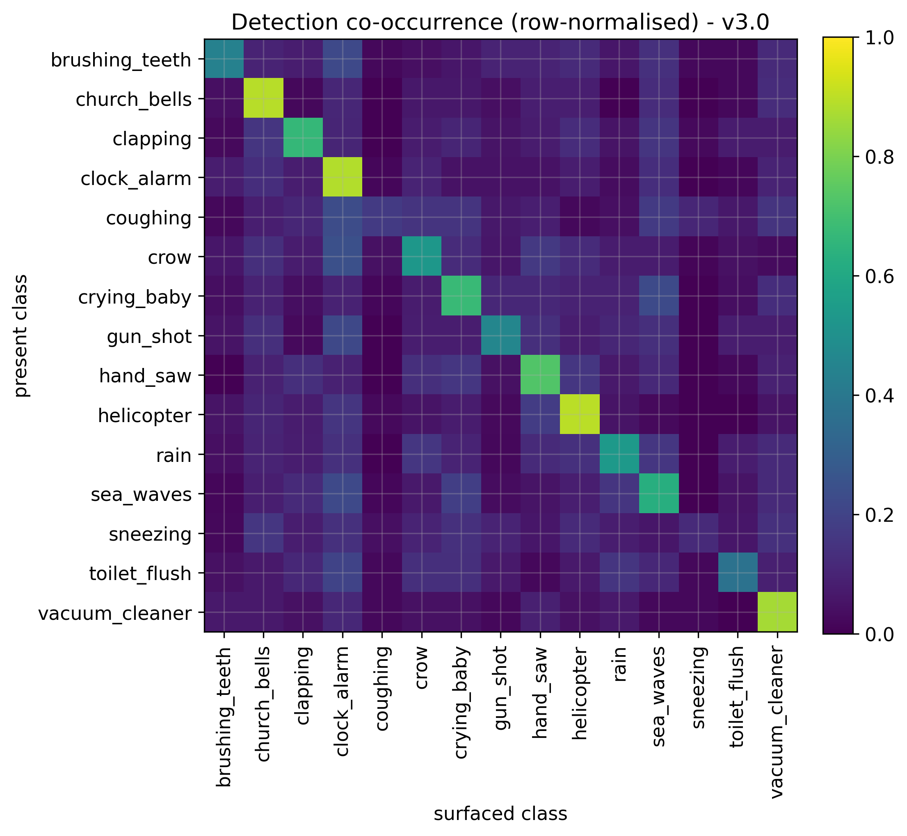

**Şekil 4.11:** Sınıfların birlikte tespit edilme (co-occurrence) matrisi.

## 4.7 Niteliksel Sonuçlar

Niceliksel metriklerin yanı sıra, modelin çıktısı spektrogram görselleştirmeleri ve dinleme testleriyle niteliksel olarak da değerlendirilmiştir. Çalar saat, helikopter ve elektrikli süpürge sınıfları için karışım, hedef ve model kestirimi spektrogramları sırasıyla Şekil 4.12, Şekil 4.13 ve Şekil 4.14'te gösterilmiştir. Bu görselleştirmeler, modelin sorgulanan sınıfın spektro-zamansal yapısını koruyarak karışımın geri kalanını bastırdığını ortaya koymaktadır.

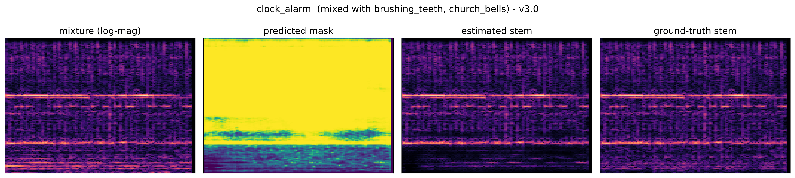

**Şekil 4.12:** Çalar saat sınıfı için karışım, hedef ve model kestirimi spektrogramları.

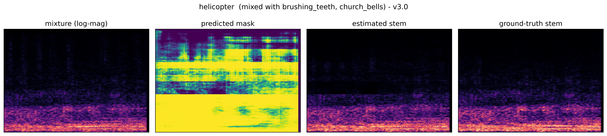

**Şekil 4.13:** Helikopter sınıfı için karışım, hedef ve model kestirimi spektrogramları.

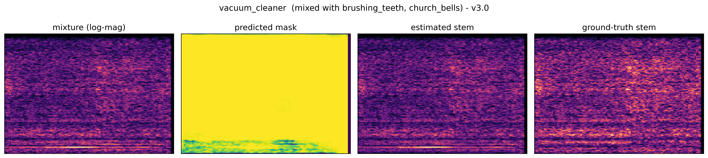

**Şekil 4.14:** Elektrikli süpürge sınıfı için karışım, hedef ve model kestirimi spektrogramları.

Çıkarma işleminin zaman düzlemindeki etkisi Şekil 4.15'teki gösterimde sunulmuştur; bu gösterim, seçilen sınıfın karışımdan çıkarılmasından önceki ve sonraki dalga biçimlerini karşılaştırmaktadır. Dinleme testlerinde, üçüncü bölümde açıklanan örtüşme oranı düzeltmesinin (Alt Başlık 3.8.3) ardından parça sınırlarındaki düzenli darbeli yapaylığın ortadan kalktığı doğrulanmıştır. Sürekli ve ayırt edici tınıya sahip sınıflarda (örneğin elektrikli süpürge, helikopter, çalar saat) çıkarmanın işitsel olarak belirgin biçimde etkili olduğu; kısa süreli geçici seslerde ise çıkarmanın daha sınırlı kaldığı gözlemlenmiştir.

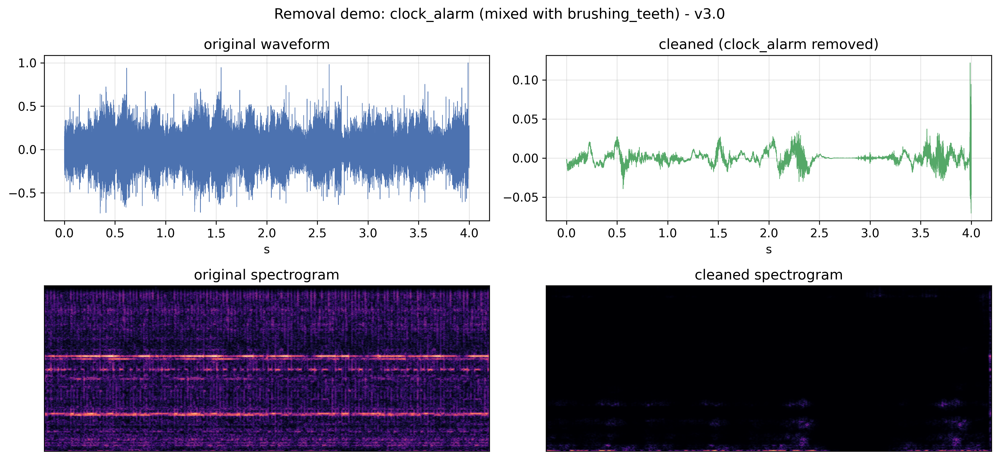

**Şekil 4.15:** Seçilen sınıfın çıkarılmasından önce ve sonra dalga biçimi karşılaştırması.

## 4.8 Sınırlılıklar ve Tartışma

Elde edilen sonuçlar, sistemin çeşitli sınırlılıklarını da ortaya koymaktadır. Birinci sınırlılık, faz yeniden kullanımından kaynaklanmaktadır. Model yalnızca genlik düzleminde çalıştığından ve yeniden sentez karışımın fazını kullandığından, dalga biçimi düzeyindeki yeniden yapılandırma kalitesi yapısal olarak sınırlanmaktadır; bu durum, özellikle hedef-baskın karışımlarda negatif SI-SDRi değerlerinin başlıca nedenidir. Faz duyarlı ya da karmaşık maske türevleri (Alt Başlık 2.3) ile dalga biçimi düzlemli modeller (Alt Başlık 2.4) bu sınırı aşma potansiyeli taşımaktadır.

İkinci sınırlılık, kısa süreli ve düşük enerjili geçici seslerin (hapşırık, öksürük) düşük duyarlılıkla tespit edilmesidir. Bu sınıflar hem akustik olarak birbirine benzemekte hem de bir saniyelik pencere içinde seyrek biçimde konumlandığından, tespit başının güvenli bir varlık olasılığı üretmesi güçleşmektedir. Daha uzun bağlam pencereleri ya da geçici seslere özgü veri artırımı, bu sınıflarda duyarlılığı artırabilir.

Üçüncü sınırlılık, SI-SDR ölçütünün hedef-baskın karışımlardaki davranışıdır. Bu ölçüt, hedefin hâlihazırda izole olduğu örneklerde maskelemeyi cezalandırdığından, algısal kaliteyi tam olarak yansıtmamaktadır. Gelecekteki değerlendirmelerde, hedef baskınlığı yüksek örneklerin süzülmesi ya da algısal ölçütlerin (örneğin algısal değerlendirme tabanlı metrikler) eklenmesi, başarımın daha doğru ölçülmesini sağlayabilir.

Dördüncü sınırlılık, önerilen modelin on beş sınıflık düzenlenmiş bir sözcük dağarcığıyla sınırlı olmasıdır. Bu sınırlama, başarımı yüksek tutmak amacıyla bilinçli olarak yapılmış bir ödünleşimdir; ancak web uygulamasının yalnızca bu on beş sesi tespit edip çıkarabilmesi anlamına gelmektedir. Sözcük dağarcığının, her yeni sınıf için yeterli ve temiz veriyle dengeli biçimde genişletilmesi, ileride yapılması önerilen çalışmalar arasındadır. Son olarak, değerlendirmenin sentetik karışımlar üzerinde yapılması, gerçek dünyanın yankılı (reverberant) ve değişken kayıt koşullarıyla bir alan boşluğu (domain gap) oluşturmaktadır; gerçek kayıtlar üzerinde yapılan dinleme testleri olumlu olsa da, bu boşluğun nicel olarak ölçülmesi ek bir değerlendirme gerektirmektedir.